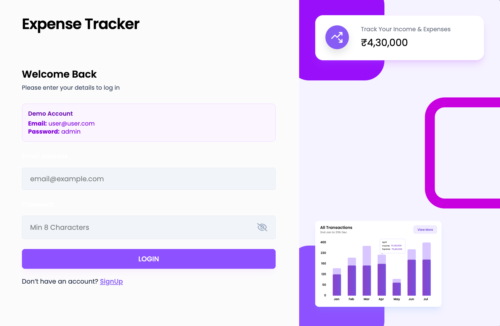
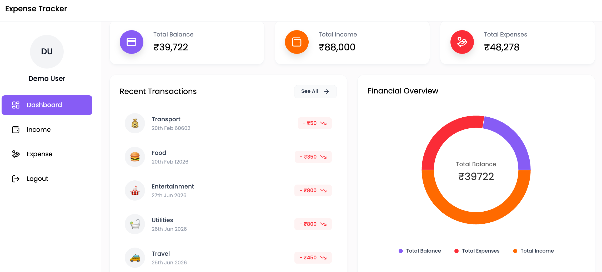
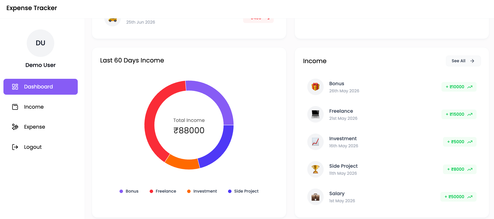
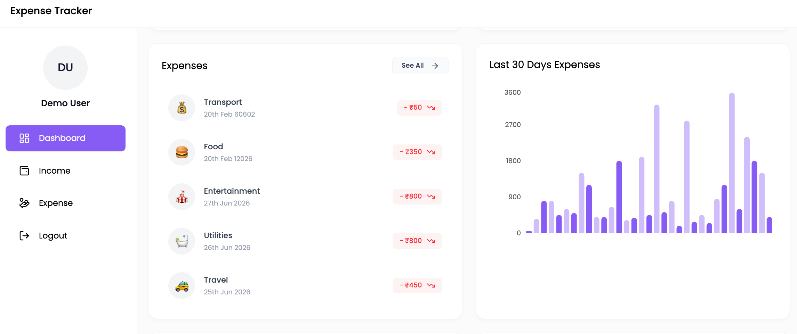
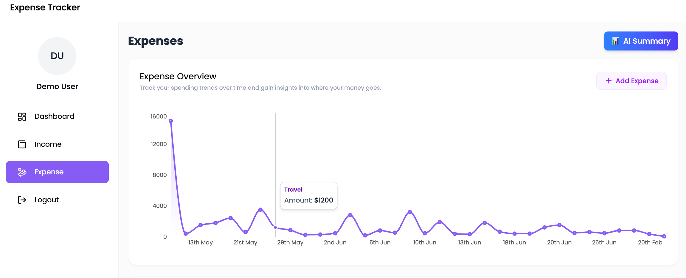
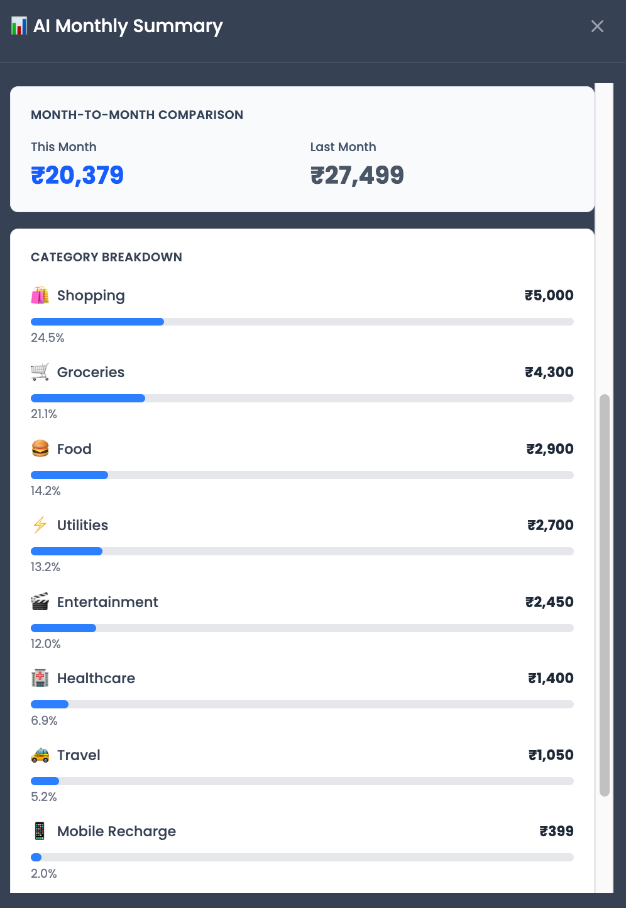
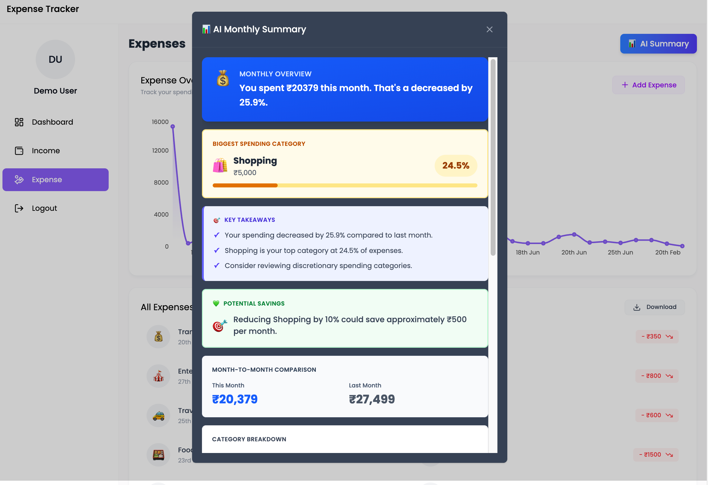
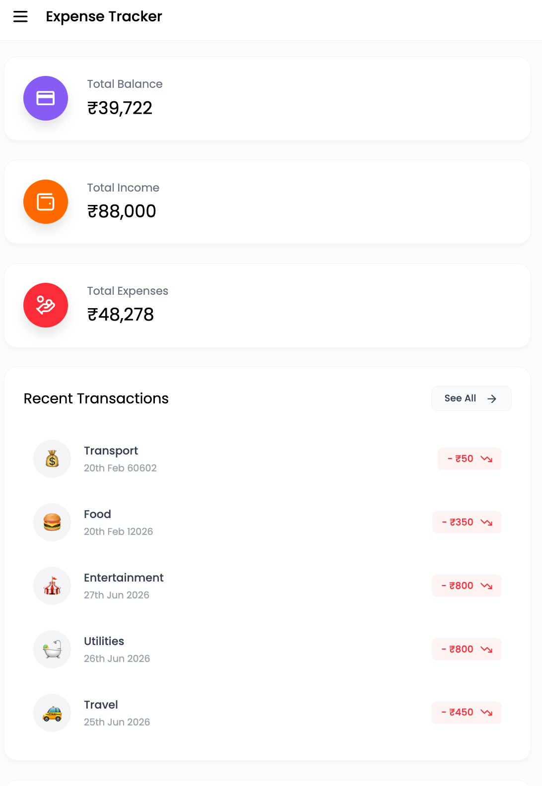

# 💰 AI-Powered Expense Tracker

A full-stack MERN Expense Tracker that helps users manage income and expenses, visualize spending habits, and receive AI-powered financial insights using Google Gemini AI.


## 🚀 Live Demo

🔗 https://expense-tracker-nine-wheat-94.vercel.app

## 📸 Screenshots

### 🔐 Login Page


### 📊 Dashboard


### 💰 Income Management


### 💸 Expense Management


### 📈 Expense Analytics


### 🤖 AI Expense Categorization


### 🧠 AI Monthly Summary


### 📱 Mobile View


### Demo Credentials

Email: `user@user.com`

Password: `admin`

---

## 💡 Problem Statement

Managing expenses across multiple payment methods can become difficult and unorganized. Users often struggle to understand where their money goes and identify opportunities to save.

This application solves that problem by providing:

* Expense and income tracking
* Visual spending analytics
* AI-powered categorization
* AI-generated financial insights
* Personalized saving recommendations

---

## ✨ Features

### Core Features

* 🔐 Secure JWT Authentication
* 💵 Income & Expense Management
* 📊 Interactive Charts & Analytics
* 📈 Financial Dashboard
* 📥 Excel Export Functionality
* 📱 Fully Responsive Design
* 🎨 Modern User Interface

### 🤖 AI Features

#### Smart Expense Categorization

Users can enter an expense description and Google Gemini AI automatically suggests the most relevant category.

Examples:

* "Pizza with friends" → Food
* "Uber ride to college" → Transport
* "Netflix subscription" → Entertainment

#### AI Monthly Summary

The application analyzes spending data and generates:

* Spending trend analysis
* Largest expense category
* Personalized savings suggestions
* Key financial takeaways
* Month-to-month comparisons

Example:

> Shopping accounts for 24% of your spending. Reducing shopping expenses by 10% could save approximately ₹500 per month.

---

## 🎯 Project Highlights

* Built a complete MERN stack application from scratch
* Integrated Google Gemini AI API
* Implemented JWT Authentication & Authorization
* Created interactive financial dashboards using Recharts
* Developed AI-powered spending analysis features
* Exported financial data to Excel
* Deployed full-stack application on Vercel

---

## 🛠️ Tech Stack

### Frontend

* React 18
* Vite
* Tailwind CSS
* Recharts
* Axios
* React Hot Toast
* React Icons

### Backend

* Node.js
* Express.js
* MongoDB Atlas
* Mongoose
* JWT Authentication
* BcryptJS
* Multer
* Google Generative AI SDK

### Deployment

* Frontend: Vercel
* Backend: Vercel
* Database: MongoDB Atlas

---

## 🏗️ System Architecture

```text
React Frontend
      ↓
 Express API
      ↓
 MongoDB Atlas
      ↓
 Gemini AI API
```

---


## 📁 Project Structure

```text
Expense-Tracker/
│
├── backend/
│   ├── config/
│   ├── controllers/
│   ├── middleware/
│   ├── models/
│   ├── routes/
│   ├── services/
│   └── server.js
│
├── frontend/
│   └── expense-tracker/
│       ├── src/
│       ├── public/
│       └── package.json
│
├── README.md
└── .gitignore
```

---

## ⚙️ Installation

### Clone Repository

```bash
git clone https://github.com/harshad-1255/Expense-Tracker.git
cd Expense-Tracker
```

### Backend Setup

```bash
cd backend
npm install
```

Create `.env`

```env
MONGO_URI=your_mongodb_uri
JWT_SECRET=your_jwt_secret
GEMINI_API_KEY=your_gemini_api_key
CLIENT_URL=http://localhost:5173
```

Start Backend

```bash
npm run dev
```

### Frontend Setup

```bash
cd frontend/expense-tracker
npm install
npm run dev
```

Open:

```text
http://localhost:5173
```

---

## 🔑 Key API Endpoints

### Authentication

* POST `/api/v1/auth/register`
* POST `/api/v1/auth/login`
* GET `/api/v1/auth/getUser`

### Expenses

* POST `/api/v1/expense/add`
* GET `/api/v1/expense/get`
* DELETE `/api/v1/expense/:id`
* GET `/api/v1/expense/downloadexcel`

### Income

* POST `/api/v1/income/add`
* GET `/api/v1/income/get`
* DELETE `/api/v1/income/:id`
* GET `/api/v1/income/downloadexcel`

### AI

* POST `/api/v1/ai/categorize`
* GET `/api/v1/ai/monthly-summary`

---

## 🔒 Security Features

* JWT Authentication
* Password Hashing with Bcrypt
* Protected Routes
* Environment Variable Management
* Secure API Communication
* Input Validation

---

## 🎓 Key Learnings

* MERN Stack Development
* REST API Design
* JWT Authentication
* MongoDB Schema Design
* React Context API
* AI Integration with Google Gemini
* Full-Stack Deployment
* Financial Data Visualization

---

## 👨‍💻 Author

**Harshad Kadam**

GitHub: https://github.com/harshad-1255

LinkedIn: Add your LinkedIn URL

Live Demo: https://expense-tracker-nine-wheat-94.vercel.app

---

⭐ If you found this project interesting, consider starring the repository.
